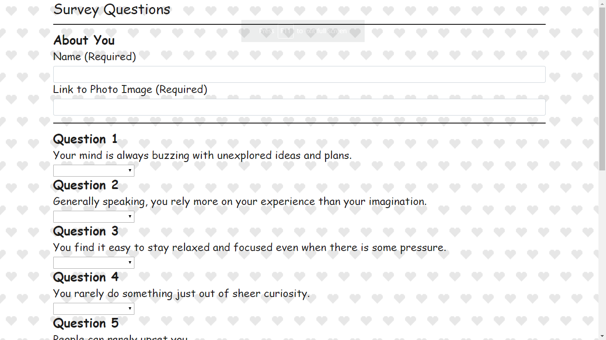

# FriendFinder

### File

* [`bamazon`](bamazon/blob/master/survey.js)

### Technologies
Node, Javascript, JQuery

### Description
A compatibility-based "FriendFinder" application that takes in results from users' surveys, then compares their answers with those from other users. The app will then display the name and picture of the user with the best overall match.

1. Link: 
     Site Link: https://glacial-cliffs-99740.herokuapp.com/
     Github Link: https://github.com/shruti-gaonkar/FriendFinder

      

2. The survey has 10 questions. Each answer is on a scale of 1 to 5 based on how much the user agrees or disagrees with a question. 

3. Once the app has found the current user's most compatible friend, the result is displayed as a modal pop-up. The modal displays both the name and picture of the closest match.

4. The current user's information is then added to the friend's list.